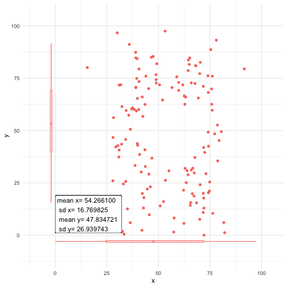
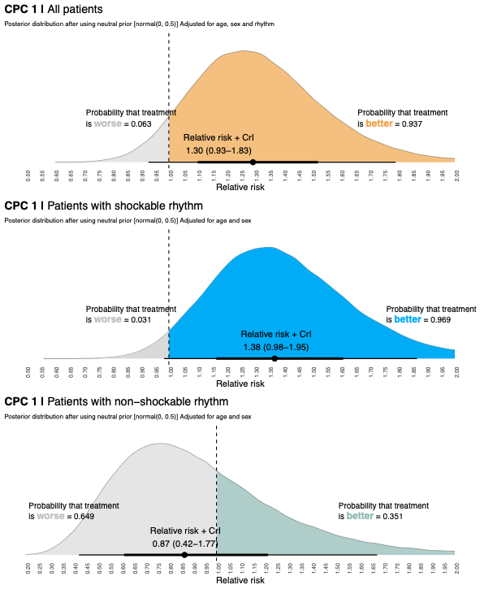
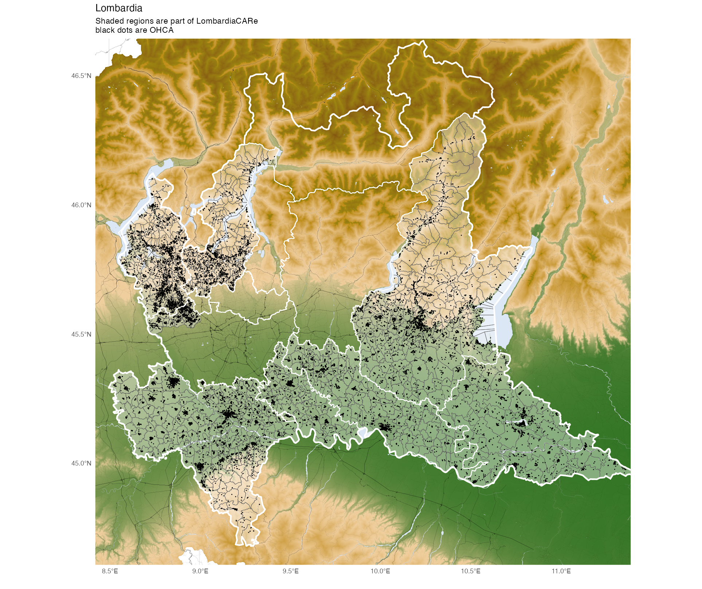
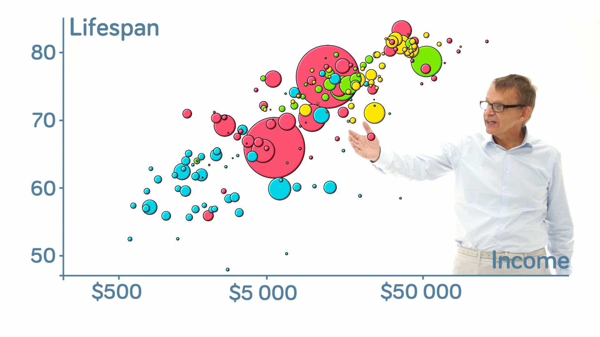
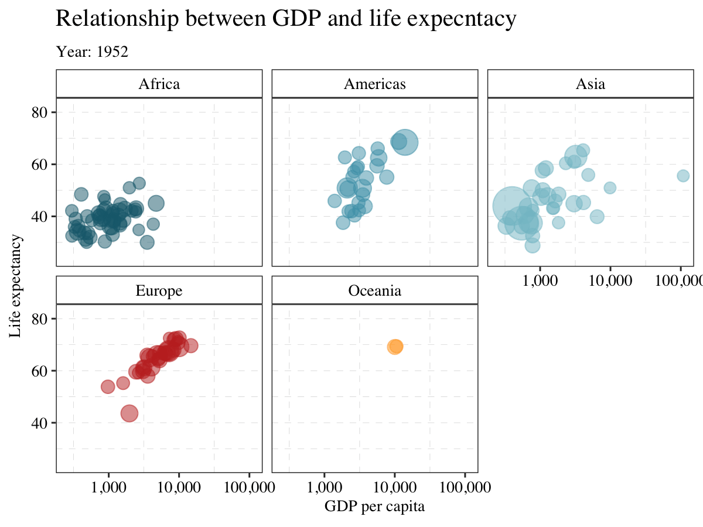

## Disposition

-   Syftet med denna presentation är att introducera *Grammar of Graphics* och ggplot2.

-   Jag kommer att visa många olika typer av plottar, men det är inte heltäckande (många typer av plots kommer inte att tas upp).

-   Du kan följa presentationen i R genom att kopiera koden för varje bild. För att göra det behöver du säkerställa att tidigare bilder har körts (dvs. att paketen är laddade och att data har importerats).

# Grammar of graphics

## Vad är "grammar of graphics" ?

-   *Grammar of Graphics* är ett ramverk utvecklat av Leland Wilkinson (1944–2021).

-   Grammatik är "ett regelsystem för ett språk som beskriver hur orddelar kombineras"

-   Dvs. en graf kan brytas ner i mindre beståndsdelar.

## Komponenter i "grammar of graphics"

Komponenter:

-   Data
-   Aesthetics
-   Geometries
-   Theme
-   Coordinates
-   Facets
-   Statistics

## Data

**Data** är i regel det vi vill visa i en plott

-   Oftast data som vi använder för vår analys

    Skrivs som `data=`

## Estetik (aesthetics)

**Aesthetics** beskriver hur vi presenterar data

-   Detta inkluderar position, storlekt, form och färg

    Skrivs som `aes(x=x, y=y)`

## Geometriska object (geometrics)

-   Formen på visualiseringen

-   Detta är oftast den största skillnaden mellan olika figurer

    Exampel: `geom_histogram()` or `geom_point()`

## Teman (themes)

-   Temans är allting som inte är relaterat till data

-   Exempel textstorlek, grids, bakgrundsfärg etc.

    Skriv som: `theme(legend.postion="bottom")`

## Koordinater (coordinates)

-   Koordinater är formatet på x och y axeln

-   Skrivs som: `scale_y_log10()`

## Facets

-   Facets används då vi vill dela in en figure i subfigurer

-   Exempelvis en figur för man och en figur för kvinnor

    Exempel: `facet_wrap()`

## Statistik (Statistics)

-   Statistik kan räknas ut för i den plottade datan.

-   Deta görs i regel "under the hood" (exempel: stapeldiagram)

## Vad är poängen med "grammar of graphics"?

-   Användningen av dessa ”komponenter” kommer att bli tydlig i exempelfigurerna

-   Du behöver inte komma ihåg allt...

-   Men bra att veta att det inte är slumpmässia ord

## Varför visualisera data?

-   Summeringar kan vara missvisande

    

## Varför visualisera data?

-   Ett mer effektivt sätta att kommunicera data
-   Lätt att identifiera outliers/felaktig data
-   Visar fördelning av data (exempel: normalfördelning)

## Data visualisation as a painting

En figur kan ses som en tavla.

Du startar med en tom kanvas som sedan fylls på med fler detaljer

Många av exemplen i presentationen börjar med en enkel graf och blir successivt mer och mer komplexa.

# ggplot2

## ggplot2

-   "Grammar of graphics" är "gg" i ggplot2

-   Utvecklades 2005 av Hadley Wickham

-   Baseras på Wilkinsons grammar of graphics

## ggplot exempel

## Animationer


## Figurer



## Kartor



## Komponenterna i ggplot2 är samma som i "grammar of graphics"

-   Data
-   Aesthetics
-   Geometries
-   Theme
-   Coordinates
-   Facets
-   Statistics

## R lingo uppfräschning

`%>%` är en pipe. Kan utläsas som "och sen"

`ggplot()` är en funktion

`datafile %>% ggplot()` utläses som: använd `datafile` `"och sen"` använd funktionen `ggplot()`

# ggplot2 basics

We will create a basic plot just to quickly get a understanding of the most commonly used arguments and functions

```{r, include=FALSE}
library(ggplot2)
theme_set(theme_gray())
```

## Data som används i exemplen

Data från gapminder används till alla exempel



## Gapminder data

```{r}
if (!require('tidyverse')) install.packages('tidyverse'); library('tidyverse')
if (!require('gapminder')) install.packages('gapminder'); library('gapminder')

data("gapminder")

head(gapminder)
```

## En enkel plot

```{r}
#| fig-width: 6
#| fig-height: 4

#Ladda paketet
library(ggplot2) 

ggplot(
       # Först specificera vilken data
       data = gapminder, 
       # Allt som anges inom aes() ska komma från datan
       # I detta fall ska färgen baseras på "continent" och storleken på "pop"
       mapping = aes(x=continent, 
                     y=gdpPercap, 
                     color=continent,
                     size=pop)) + 
  # position = "jitter" används så att punkterna in överlappar
  geom_point(position = "jitter") 

```

## Samma plot, olika sätt att koda

Nästan allt i R kan göras på olika sätt.

Det är oftast en fråga om tycke och smak

## Exampel 1: Global färg, global estetik

Alla "geoms" använder sig av data specificerat inom `ggplot()`

```{r}
#| output-location: column
#| fig-width: 6
#| fig-height: 4

ggplot(data = gapminder, 
       mapping = aes(x=continent, 
                     y=gdpPercap, 
                     color=continent,
                     size=pop)) + 
  geom_point(position = "jitter") 
```

## Exampel 2, Lokal data, lokal estetik

Allt anges inom funktionen `geom_point()`

```{r}
#| output-location: column
#| fig-width: 6
#| fig-height: 4

ggplot() + 
  geom_point(data = gapminder, 
       mapping = aes(x=continent, 
                     y=gdpPercap, 
                     color=continent,
                     size=pop),
       position = "jitter") 
```

## Exampel 3 Tidyverse

Specificera data och sedan plotta

```{r}
#| output-location: column
#| fig-width: 6
#| fig-height: 4

gapminder %>% 
ggplot() + 
  geom_point(mapping = aes(x=continent, 
                           y=gdpPercap, 
                           color=continent,
                           size=pop),
             position = "jitter") 
```

## Nu kan du använda ggplot2

I stort sett samma kod kan producera olika plottar. Det enda som ändras är `geom_*`

# Några exempel på "geoms" som kan användas

## Exempel med en kategorisk och en kontinuerlig variabel

## boxplot

```{r}
#| output-location: column
#| fig-width: 6
#| fig-height: 4
#| code-line-numbers: "5|1-5"
ggplot(data = gapminder, 
       mapping = aes(x=continent, 
                     y=gdpPercap, 
                     color=continent)) + 
  geom_boxplot() 

```

## Bar plot `(geom_col`)

```{r}
#| output-location: column
#| fig-width: 6
#| fig-height: 4
#| code-line-numbers: "5|1-5"
ggplot(data = gapminder, 
       mapping = aes(x=continent, 
                     y=gdpPercap, 
                     fill=continent)) + 
  geom_col() 

```

## Violin plot

```{r}
#| output-location: column
#| fig-width: 6
#| fig-height: 4
#| code-line-numbers: "5|1-5"
ggplot(data = gapminder, 
       mapping = aes(x=continent, 
                     y=gdpPercap, 
                     color=continent)) + 
  geom_violin() 


```

## Kontinuerliga variabler

Fler alternativ blir tillgängliga om vi ändrar x-axeln till en kontinuerlig variabel.

## Density plot

```{r}
#| output-location: column
#| fig-width: 6
#| fig-height: 4
#| code-line-numbers: "4|1-5"
ggplot(data = gapminder, 
       mapping = aes(x=lifeExp, 
                     fill=continent)) + 
  geom_density(alpha=0.5) 
```

## Histogram

```{r}
#| output-location: column
#| fig-width: 6
#| fig-height: 4
#| code-line-numbers: "4-6|1-6"
ggplot(data = gapminder, 
       mapping = aes(x=lifeExp, 
                     fill=continent)) + 
  geom_histogram(alpha=0.5, 
                 binwidth = 1, 
                 color="black") 
```

## Två kontinuerliga variabler

## Scatter plot

Här måste vi specificera en till variabel

```{r}
#| output-location: column
#| fig-width: 6
#| fig-height: 4
#| code-line-numbers: "3|6|1-9"
ggplot(data = gapminder, 
       mapping = aes(x=gdpPercap, 
                     y=lifeExp, 
                     color=continent,
                     size=pop)) + 
  geom_point() 
```

## Line plot

ändra `geom`

```{r}
#| output-location: column
#| fig-width: 6
#| fig-height: 4
#| code-line-numbers: "5|1-5"
ggplot(data = gapminder, 
       mapping = aes(x=year, 
                     y=lifeExp, 
                     color=continent)) + 
  geom_path() 
```

## Heatmap

```{r}
#| output-location: column
#| fig-width: 6
#| fig-height: 4
#| code-line-numbers: "4|1-5"
ggplot(data = gapminder, 
       mapping=aes(x = gdpPercap, 
                   y = lifeExp)) +
  geom_bin2d(bins = 60)
```

## Vanliga misstag vid färganvändande

Om färgerna ska baseras på värden från datan ska variabeln anges inom `aes()`

Så här:

```{r}
#| output-location: column
#| fig-width: 6
#| fig-height: 4
#| code-line-numbers: "6|1-6"
ggplot(data = gapminder, 
       mapping = aes(x=continent, 
                     y=gdpPercap,
                     size=pop)) + 
  geom_point(position = "jitter", 
             aes(color=continent)) 
```

## Om det anges utanför `aes()` kommer ggplot inte att förstå vad det betyder.

```{r, error=TRUE}
#| output-location: column
#| fig-width: 6
#| fig-height: 4
ggplot(
       data = gapminder, 
       mapping = aes(x=continent, 
                     y=gdpPercap,
                     size=pop)) + 
  geom_point(position = "jitter", 
             color=continent) 
```

## Om det anges utanför `aes()` behöver du ange vilken färg som ska användas.

```{r}
#| output-location: column
#| fig-width: 6
#| fig-height: 4
#| code-line-numbers: "7|1-7"
ggplot(
       data = gapminder, 
       mapping = aes(x=continent, 
                     y=gdpPercap,
                     size=pop)) + 
  geom_point(position = "jitter", color="red") 
```

## En kommentar angående teman (themes)

-   Som nämnts tidigare är *theme* allt som **inte** är relaterat till data.
-   Inte superviktigt, men vi kan ändra många saker genom att använda teman.

```{r, include=TRUE}
#| output-location: slide
#| fig-width: 12
#| fig-height: 8

ggplot(data=gapminder,
       aes(x=continent, y=gdpPercap, color=continent)) +
  geom_point(alpha=0)+
  labs(title="Plot with theme settings",
       subtitle = "subtitle to plot",
       caption = "caption to plot")+
  theme(plot.background = element_rect(fill="pink", color="tomato3", size=3),
        panel.background = element_rect(color="wheat4", fill="springgreen3"),,
        panel.grid.major.x = element_line(linetype = 1, linewidth=0.1, color="yellow"),
        panel.grid.major.y = element_line(linetype = 2, linewidth=0.2, color="black"),
        panel.grid.minor.x = element_line(linetype = 3, linewidth=0.3, color="blue"),
        panel.grid.minor.y = element_line(linetype = 4, linewidth=0.4, color="red"),
        axis.ticks.x = element_line(linewidth = 2, color="skyblue"),
        axis.ticks.y = element_line(linewidth = 1, color="steelblue"),
        axis.text.x = element_text(color="violetred4", family = "Times New Roman", size=15),
        axis.text.y = element_text(color="turquoise4", family = "Helvetica", size=10),
        axis.title.x = element_text(color="forestgreen", family = "Comic Sans MS", size=25),
        axis.title.y = element_text(color="red", family = "Arial", size=20),
        plot.title = element_text(color="tomato3", family = "Comic Sans MS", size=15),
        plot.subtitle = element_text(color="blue", family = "Comic Sans MS", size=8),
        plot.caption = element_text(color="yellow", family = "Comic Sans MS", size=15),
        legend.background = element_rect(fill="royalblue"),
        legend.box.background = element_rect(fill="seagreen"),
        legend.title = element_text(color="tomato", family = "Times New Roman", size=10),
        legend.text = element_text(color="wheat"),
        legend.position = c(0.5,0.5),
        legend.title.position = "bottom",
        legend.direction = "horizontal"
        )

```

## En kommentar angående teman (themes)

Det finns flera fördefinierade teman i ggplot2 (och ännu fler i tilläggspaket)

De specificeras med: + `theme_name()`

```{r, echo=FALSE}

cowplot::plot_grid(

ggplot(data=gapminder, aes(x=continent, 
                      y=gdpPercap, 
                      color=continent)) +
  geom_point(alpha=0) + 
  ggtitle("theme_gray() [default theme]") + theme_gray(),

ggplot(data=gapminder, aes(x=continent, 
                      y=gdpPercap, 
                      color=continent)) +
  geom_point(alpha=0) + ggtitle("theme_bw()") + theme_bw(),

ggplot(data=gapminder, aes(x=continent, 
                      y=gdpPercap, 
                      color=continent)) +
  geom_point(alpha=0) + ggtitle("theme_dark()") + theme_dark(),

ggplot(data=gapminder, aes(x=continent, 
                      y=gdpPercap, 
                      color=continent)) +
  geom_point(alpha=0) + ggtitle("theme_classic()") + theme_classic()
)
```

## Du kan skapa ditt eget theme

```{r}

my_theme <- function() { theme_bw() +
  theme(plot.background = element_rect(fill="white", color="white", size=1),
        panel.background = element_rect(color="white", fill="white"),
        panel.grid.major.x = element_blank(),
        panel.grid.major.y = element_line(linetype = 2, linewidth=0.1, color="grey80"),
        panel.grid.minor.x = element_line(linetype = 2, linewidth=0.1, color="grey80"),
        panel.grid.minor.y = element_line(linetype = 2, linewidth=0.1, color="grey80"),
        axis.text.x = element_text(color="black", family = "serif", size=10),
        axis.text.y = element_text(color="black", family = "serif", size=10),
        axis.title.x = element_text(color="black", family = "serif", size=10),
        axis.title.y = element_text(color="black", family = "serif", size=10, angle = 90),
        plot.title = element_text(color="black", family = "serif", size=15),
        plot.subtitle = element_text(color="black", family = "serif", size=10),
        plot.caption = element_text(color="black", family = "serif", size=8),
        legend.title = element_text(color="black", family = "serif", size=10),
        legend.text = element_text(color="black", family = "serif", size=10),
        legend.background = element_rect(fill="white"),
        legend.box.background = element_rect(fill="white", color="white"),
        legend.position = "bottom",
        legend.title.position = "left",
        legend.direction = "horizontal",
        strip.text.x = element_text(color="black", family = "serif", size=10),
        strip.text.y = element_text(color="black", family = "serif", size=10), 
        strip.background = element_rect(fill="white")
        )
}

```

## Du kan skapa ditt eget theme

Efter att temat har definierats kan du antingen skriva koden så här:

```{r}
#| output-location: column
#| fig-width: 12
#| fig-height: 8
#| code-line-numbers: "9|1-9"
ggplot(data=gapminder,
       aes(x=continent, 
           y=gdpPercap, 
           color=continent)) +
  geom_point(alpha=0)+
  labs(title="Plot with theme settings",
       subtitle = "subtitle to plot",
       caption = "caption to plot")+
  my_theme()
```

## Sätt tema för alla framtida grafer

Det är möjligt att ange ett standardtema

Detta används automatiskt som ny default om inget annat specificeras

```{r}
#| output-location: column
#| fig-width: 6
#| fig-height: 4
## Sets the theme as default
theme_set(my_theme())

ggplot(data=gapminder,
       aes(x=continent, 
           y=gdpPercap, 
           color=continent)) +
  geom_point(alpha=0)+
  labs(title="Plot with theme settings",
       subtitle = "subtitle to plot",
       caption = "caption to plot")


```

## Installera och ladda paket

-   Den här koden kontrollerar om du har paketet installerat, och om inte kommer R att installera det.

-   Om det redan är installerat kommer R att ladda paketet.

```{r, echo=TRUE, eval=FALSE}

if (!require('tidyverse')) install.packages('tidyverse'); library('tidyverse')
if (!require('gapminder')) install.packages('gapminder'); library('gapminder')

```

## Som ni såg tidigare kan mycket små förändringar påverka grafen.

-   Låt oss gå tillbaka till vår boxplot

-   Det finns förbättringspotential

```{r}
#| output-location: column
#| fig-width: 6
#| fig-height: 4
library(tidyverse)
library(gapminder)
data("gapminder")

ggplot(data = gapminder, 
       mapping = aes(x=continent, 
                     y=gdpPercap, 
                     color=continent)) + 
  geom_boxplot() 

```

## Starta med färgerna

ggplot2 har två olika färgargument:

-   `color =` används för linjer och punkter

-   `fill =` används för ytor som kan fyllas

## Ändra färgerna i boxplot

1.  Ändra från `color` till `fill`.
2.  Ange vilka färger vi vill använda.
3.  Ta bort outliers.

```{r, echo=T, eval=T}
#| output-location: column
#| fig-width: 6
#| fig-height: 4
#| code-line-numbers: "4|7-9|6|1-20"
gapminder %>% 
  ggplot(aes(x=continent, 
             y=gdpPercap, 
             fill=continent,
             shape=continent))+
  geom_boxplot(outliers=F)+
  scale_fill_manual(values=c("#16697a", "#489fb5", "#82c0cc", "#c32f27", "#ffa62b"))+
  labs(x="Continent",
       y="GDP per capita",
       title = "GDP per capita",
       subtitle = "By continent",
       caption = "") 
```

## Ytterligare ändringar

1.  Ändra transparans
2.  Flera lager kan läggas till i samma graf

```{r}
#| output-location: column
#| fig-width: 6
#| fig-height: 4
#| code-line-numbers: "5-11|16-18|1-30"
gapminder %>% 
  ggplot(aes(x=continent, 
             y=gdpPercap, 
             fill=continent))+
  geom_point(aes(color=continent), 
             position = 
             position_jitterdodge(
                 jitter.width = 1, 
                 dodge.width = 0.8), 
             alpha=0.5, 
             size=0.5)+
  geom_boxplot(outliers=F, alpha=0.5)+
  scale_fill_manual(values=c("#16697a", "#489fb5", "#82c0cc", "#c32f27", "#ffa62b"))+
  scale_color_manual(values=c("#16697a", "#489fb5", "#82c0cc", "#c32f27", "#ffa62b"))+
  labs(x="Continent",
       y="GDP per capita",
       title = "GDP per capita",
       subtitle = "By continent",
       caption = "") +
  coord_cartesian(ylim = c(0,50000))
```

# Visualisera sambandet mellan två kontinuerliga variabler

-   Det föregående exemplet innehöll en kategorisk och en kontinuerlig variabel

-   Vi kan plotta sambandet mellan två kontinuerliga variabler

## Gapminder data

-   Vi använder samma dataset som tidigare

```{r, echo=TRUE, eval=T}
if (!require('gapminder')) install.packages('gapminder'); library('gapminder')

```

## Vi vill undersöka sambandet mellan BNP per capita och förväntad livslängd.

-   Det är alltid ett bra första steg att plotta datan.

-   Notera att vi använder samma tema som tidigare. Om vi hade börjat från början hade vi först behövt använda `theme_set()`

```{r}
#| fig-width: 12
#| fig-height: 8
gapminder %>% 
  ggplot(aes(x=gdpPercap, y=lifeExp)) +
  geom_point()
```

## Vi fortsätter med att specificera

-   `color`

-   `fill`

-   `size` (Populationen avgör storleken)

```{r}
#| fig-width: 12
#| fig-height: 8
gapminder %>% 
  ggplot(aes(x=gdpPercap, y=lifeExp, color=continent, fill=continent, size=pop))+
  geom_point(alpha=0.5)
```

## Vi vill ändra färgerna

-   Som förut specificerar vi färg genom: `scale_color_manual()`

```{r}
#| output-location: slide
#| fig-width: 12
#| fig-height: 8
#| code-line-numbers: "4-5"
gapminder %>% 
  ggplot(aes(x=gdpPercap, y=lifeExp, color=continent, fill=continent, size=pop)) + 
  geom_point(alpha=0.5) +
  scale_color_manual(values=c("#16697a", "#489fb5", "#82c0cc", "#c32f27", "#ffa62b"))+
  scale_fill_manual(values=c("#16697a", "#489fb5", "#82c0cc", "#c32f27", "#ffa62b"))
```

## Lägg till regressionslinje

-   Vi kan lägga till regressionlinjen genom att använda: `geom_smooth()`

-   Vi byter labels och lägger till en titel i funktionen `labs()`

```{r, warning=FALSE}
#| output-location: slide
#| fig-width: 12
#| fig-height: 8
#| code-line-numbers: "6-10"
gapminder %>% 
  ggplot(aes(x=gdpPercap, y=lifeExp, color=continent, fill=continent, size=pop)) + 
  geom_point(alpha=0.5) +
  scale_color_manual(values=c("#16697a", "#489fb5", "#82c0cc", "#c32f27", "#ffa62b"))+
  scale_fill_manual(values=c("#16697a", "#489fb5", "#82c0cc", "#c32f27", "#ffa62b"))+
  geom_smooth(method = "lm", se = T, linewidth=0.5)

```

## Ändra legend

Vi kan ta bort "pop"-legenden genom att ange: `guides(size="none")`

```{r, warning=FALSE}
#| output-location: slide
#| fig-width: 12
#| fig-height: 8
#| code-line-numbers: "9"
gapminder %>% 
  ggplot(aes(x=gdpPercap, y=lifeExp, color=continent, fill=continent, size=pop)) + 
  geom_point(alpha=0.5) +
  scale_color_manual(values=c("#16697a", "#489fb5", "#82c0cc", "#c32f27", "#ffa62b"), 
                     name="Continent")+
  scale_fill_manual(values=c("#16697a", "#489fb5", "#82c0cc", "#c32f27", "#ffa62b"), 
                     name="Continent")+
  geom_smooth(method = "lm", se = T, linewidth=0.5)+
  guides(size="none")
```

## Lägg till titel, undertitel och ändra legendens titel

Allt kan anges i `labs()` argumentet

```{r, warning=FALSE}
#| output-location: slide
#| fig-width: 12
#| fig-height: 8
#| code-line-numbers: "8-12"
gapminder %>% 
  ggplot(aes(x=gdpPercap, y=lifeExp, color=continent, fill=continent, size=pop)) + 
  geom_point(alpha=0.5) +
  scale_color_manual(values=c("#16697a", "#489fb5", "#82c0cc", "#c32f27", "#ffa62b"))+
  scale_fill_manual(values=c("#16697a", "#489fb5", "#82c0cc", "#c32f27", "#ffa62b"))+
  geom_smooth(method = "lm", se = T, linewidth=0.5, )+
  guides(size="none")+
  labs(x="GDP per capita",
       y="Life expectancy",
       title = "Relationship between GDP and life expecntacy",
       subtitle = "Source: gapminder data",
       color= "Continent", fill="Continent")
```

## Skapa "subfigurer" per kontinent

-   För att dela upp grafen efter kontinent kan vi använda `facet_wrap()`

```{r, warning=FALSE}
#| output-location: slide
#| fig-width: 12
#| fig-height: 8
#| code-line-numbers: "13"
gapminder %>% 
  ggplot(aes(x=gdpPercap, y=lifeExp, color=continent, fill=continent, size=pop)) + 
  geom_point(alpha=0.5) +
  scale_color_manual(values=c("#16697a", "#489fb5", "#82c0cc", "#c32f27", "#ffa62b"))+
  scale_fill_manual(values=c("#16697a", "#489fb5", "#82c0cc", "#c32f27", "#ffa62b"))+
  geom_smooth(method = "lm", se = T, linewidth=0.5, )+
  guides(size="none")+
  labs(x="GDP per capita",
       y="Life expectancy",
       title = "Relationship between GDP and life expecntacy",
       subtitle = "Source: gapminder data",
       color= "Continent", fill="Continent")+
  facet_wrap(~ continent) 
```

## Lite bättre men inte optimalt

-   Vi får mer utrymme om vi tar bort legenden.

-   Samtidigt ändrar jag bakgrundsfärgen för facets.

```{r, warning=FALSE}
#| output-location: slide
#| fig-width: 12
#| fig-height: 8
#| code-line-numbers: "14-16"
gapminder %>% 
  ggplot(aes(x=gdpPercap, y=lifeExp, color=continent, fill=continent, size=pop)) + 
  geom_point(alpha=0.5) +
  scale_color_manual(values=c("#16697a", "#489fb5", "#82c0cc", "#c32f27", "#ffa62b"))+
  scale_fill_manual(values=c("#16697a", "#489fb5", "#82c0cc", "#c32f27", "#ffa62b"))+
  geom_smooth(method = "lm", se = T, linewidth=0.5, )+
  guides(size="none")+
  labs(x="GDP per capita",
       y="Life expectancy",
       title = "Relationship between GDP and life expecntacy",
       subtitle = "Source: gapminder data",
       color= "Continent", fill="Continent")+
  facet_wrap(~ continent) +
  theme(legend.position = "none",
        strip.text.x = element_text(color=c("black")),
        strip.background = element_rect(fill=c("white")))

```

## Konvertera x-axeln

-   Vi ändrar x-axeln till logaritmisk skala med `scale_x_log10()`

```{r, warning=FALSE}
#| output-location: slide
#| fig-width: 12
#| fig-height: 8
#| code-line-numbers: "17"
gapminder %>% 
  ggplot(aes(x=gdpPercap, y=lifeExp, color=continent, fill=continent, size=pop)) + 
  geom_point(alpha=0.5) +
  scale_color_manual(values=c("#16697a", "#489fb5", "#82c0cc", "#c32f27", "#ffa62b"))+
  scale_fill_manual(values=c("#16697a", "#489fb5", "#82c0cc", "#c32f27", "#ffa62b"))+
  geom_smooth(method = "lm", se = T, linewidth=0.5, )+
  guides(size="none")+
  labs(x="GDP per capita",
       y="Life expectancy",
       title = "Relationship between GDP and life expecntacy",
       subtitle = "Source: gapminder data",
       color= "Continent", fill="Continent")+
  facet_wrap(~ continent) +
  theme(legend.position = "none",
        strip.text.x = element_text(color=c("black")),
        strip.background = element_rect(fill=c("white")))+
  scale_x_log10(labels = scales::comma_format(scale = 1))
```

# ggplot2 tilläggspaket

## Tilläggspaket

ggplot2 är mycket användbart i sig självt, men det finns tilläggspaket som möjliggör nästan alla möjliga figurer

Exempel kan hittas på: <https://exts.ggplot2.tidyverse.org/gallery/>

## Animation

Ett paket som kan vara användbart för presentationer är paketet `gganimate`

## Lets revisit the last plot

<div>

-   För att animera behöver vi ladda/installera paketet gganimate.

-   Vi tar bort regressionslinjen genom att ta bort `geom_smooth()` och ökar punktstorleken med `scale_size_continuous()`

-   Vi lägger till år i `transition_time()` och ändrar undertiteln med `labs(subtitle = "Year: {frame_time}")`

</div>

<div>

```{r, echo=T, eval=F, error=TRUE, print=F}
#| fig-width: 12
#| fig-height: 8
#| code-line-numbers: "1|11|16|19"
if (!require('gganimate')) install.packages('gganimate'); library('gganimate')

animation <- gapminder %>% 
  ggplot(aes(x=gdpPercap, y=lifeExp, color=continent, fill=continent, size=pop)) + 
  geom_point(alpha=0.5) +
  scale_color_manual(values=c("#16697a", "#489fb5", "#82c0cc", "#c32f27", "#ffa62b"))+
  scale_fill_manual(values=c("#16697a", "#489fb5", "#82c0cc", "#c32f27", "#ffa62b"))+
  guides(size="none")+
  labs(x="GDP per capita",y="Life expectancy",
       title = "Relationship between GDP and life expecntacy",
       color= "Continent", fill="Continent", subtitle = "Year: {frame_time}")+
  facet_wrap(~ continent) +
  theme(legend.position = "none", strip.text.x = element_text(color=c("black")), 
        strip.background = element_rect(fill=c("white")))+
  scale_x_log10(labels = scales::comma_format(scale = 1)) + 
  transition_time(year) +
  scale_size_continuous(range=c(3,15))

animate(animation, height = 900, width =1200, units="px", res=200,
        renderer = file_renderer(dir = "frames", prefix = "gganim", overwrite = TRUE))

```

</div>

## Animation



# Highlight

## Highlight

Ibland har vi mycket data och det kan vara svårt att särskilja datapunkterna.

I det här exemplet använder vi återigen gapminder-data och tar fram en lista över länder av intresse.

```{r, echo=TRUE}
if (!require('gghighlight')) install.packages('gghighlight'); library('gghighlight')

## Calculate mean life expectancy and countries to highlight
gapminder <- gapminder %>% 
  group_by(country) %>% 
  mutate(mean_life = mean(lifeExp),
         highlighted_countries = case_when(country=="Italy" ~ 1, 
                                           country=="Australia" ~ 1,
                                           country=="United States" ~ 1,
                                           country=="Chile" ~ 1,
                                           country=="Sweden" ~ 1,
                                           country=="Venezuela" ~ 1,
                                           country=="Rwanda" ~ 1,
                                           country=="China" ~ 1,
                                           country=="Afghanistan" ~ 1,
                                           country=="South Africa" ~ 1,
                                           country=="Cambodia" ~ 1,
                                           country=="Turkey" ~ 1,
                                           country=="Reunion" ~ 1)) %>% ungroup()

gapminder$highlighted_countries[is.na(gapminder$highlighted_countries)] <- 0


```

## Första steget är att plotta ut data

```{r}
gapminder %>% 
  ggplot(aes(x=year, 
             y=lifeExp, 
             group=country)) +
  geom_line()
```

## Färgsätt länderna

Vi kan enkelt färgsätta linjerna genom att lägga till `color=`

Vi färgsätter dem efter kontinent (continent).

```{r}
gapminder %>% 
  ggplot(aes(x=year, 
             y=lifeExp, 
             group=country, 
             color=continent)) +
  geom_line()
```

## Ändra färgerna

Vi specificerar färgerna genom `scale_color_manual()`

```{r}
gapminder %>% 
  ggplot() + 
  geom_line(aes(x=year, 
                y=lifeExp, 
                group=country, 
                color=continent)) + 
  scale_color_manual(values=c("#16697a", "#489fb5", "#82c0cc", "#c32f27", "#ffa62b"))
```

## Det ser inte så bra ut...

För att öka läsbarheten kan vi highlighta länder av intresse.

Vi använder vår beräknade variabel "highlighted_countries"

Här behöver vi ladda ett nytt paket som heter `gghighlight`

```{r}
if (!require('gghighlight')) install.packages('gghighlight'); library('gghighlight')

gapminder %>% 
  ggplot() + 
  geom_line(aes(x=year, y=lifeExp, group=country, color=continent)) + 
  scale_color_manual(values=c("#16697a", "#489fb5", "#82c0cc", "#c32f27", "#ffa62b")) +
  gghighlight(highlighted_countries==1)
```

## Använd "facets" för ökad läsbarhet

Det är fortfarande många linjer

Vi kan öka läsbarheten genom att specificera `facet_wrap()` på samma sätta som vid animationen

```{r}
#| output-location: slide
#| fig-width: 12
#| fig-height: 8
gapminder %>% 
  ggplot() + 
  geom_line(aes(x=year, y=lifeExp, group=country, color=continent)) + 
  scale_color_manual(values=c("#16697a", "#489fb5", "#82c0cc", "#c32f27", "#ffa62b")) +
  gghighlight(highlighted_countries==1) + 
  facet_wrap(~ continent)
  
```

## Ändra `gghighlight()` parametrar

Alla länder finns i "facets".

Det kan vi ändra genom att lägga till lite information i funktionen `gghighlight()`

```{r, warning=FALSE}
#| output-location: slide
#| fig-width: 12
#| fig-height: 8

gapminder %>% 
  ggplot() + 
  geom_line(aes(x=year, y=lifeExp, group=country, color=continent)) + 
  scale_color_manual(values=c("#16697a", "#489fb5", "#82c0cc", "#c32f27", "#ffa62b"))+ 
  gghighlight(highlighted_countries==1, 
              calculate_per_facet = TRUE, 
              label_params = list(size=3),
              unhighlighted_params = list(linewidth = 0.3,
                                          colour = alpha("grey", 0.7),
                                          linetype = "dashed"))+
  facet_wrap(~ continent)

```

## Ändra några detaljer genom att använda `theme()`

Som vi gjorde tidigare kan vi ta bort den grå färgen och ändra storlek och vinkel på x-axelns text.

Allt detta specificeras i theme()

```{r, warning=FALSE}
#| output-location: slide
#| fig-width: 12
#| fig-height: 8
#| code-line-numbers: "12-15"
gapminder %>% 
  ggplot() + 
  geom_line(aes(x=year, y=lifeExp, group=country, color=continent)) + 
  scale_color_manual(values=c("#16697a", "#489fb5", "#82c0cc", "#c32f27", "#ffa62b"))+
  gghighlight(highlighted_countries==1, 
              calculate_per_facet = TRUE, 
              label_params = list(size=3),
              unhighlighted_params = list(linewidth = 0.3,
                                          colour = alpha("grey", 0.7),
                                          linetype = "dashed"))+
  facet_wrap(~ continent)+
  theme(strip.text.x = element_text(color=c("black")), 
        strip.background = element_rect(fill=c("white")),
        axis.text.x = element_text(size=8, angle=c(25)))
```

## Vi kan lägga till punkter till linjerna

```{r, warning=FALSE}
#| output-location: slide
#| fig-width: 12
#| fig-height: 8
#| code-line-numbers: "12"
gapminder %>% 
  ggplot() + 
  geom_line(aes(x=year, y=lifeExp, group=country, color=continent)) +
  scale_color_manual(values=c("#16697a", "#489fb5", "#82c0cc", "#c32f27", "#ffa62b"))+
  gghighlight(highlighted_countries==1, 
              calculate_per_facet = TRUE, 
              label_params = list(size=3),
              unhighlighted_params = list(linewidth = 0.3,
                                          colour = alpha("grey", 0.5),
                                          linetype = "dashed",
                                          size=NA))+
  geom_point(aes(x=year, y=lifeExp, group=country, color=continent))+
  facet_wrap(~ continent)+ 
  theme(strip.text.x = element_text(color=c("black")), 
        strip.background = element_rect(fill=c("white")),
        axis.text.x = element_text(size=8, angle=25))
```

## Interaktiva plottar

Med paketet `plotly` är det enkelt att göra interaktiva figurer

```{r}
#| output-location: slide
#| fig-width: 30
#| fig-height: 20
#| code-line-numbers: "1|23|1-23"
if (!require('plotly')) install.packages('plotly'); library('plotly')

p <- gapminder %>% 
  ggplot() + 
  geom_line(aes(x=year, y=lifeExp, group=country, color=continent)) +
  scale_color_manual(values=c("#16697a", "#489fb5", "#82c0cc", "#c32f27", "#ffa62b"))+
  gghighlight(highlighted_countries==1, 
              calculate_per_facet = TRUE, 
              label_params = list(size=3),
              label_key = country,
              unhighlighted_params = list(linewidth = 0.3,
                                          colour = alpha("grey", 0.5),
                                          linetype = "dashed",
                                          size=NA))+
  geom_point(aes(x=year, y=lifeExp, group=country, color=continent))+
  facet_wrap(~ continent)+ 
  theme(strip.text.x = element_text(color=c("black")), 
        strip.background = element_rect(fill=c("white")),
        axis.text.x = element_text(size=8, angle=25)) +
labs(x="Life expectancy",
    y="Year")

ggplotly(p)
```

# ggdensity

Plotta "high density region" genom att använda funktionen `geom_hdr()`

```{r}
#| output-location: slide
#| fig-width: 12
#| fig-height: 8
#| code-line-numbers: "5|1-18"
if (!require('ggdensity')) install.packages('ggdensity'); library('ggdensity')

gapminder %>% filter(year %in% c(1952, 2007)) %>% 
ggplot(aes(gdpPercap, lifeExp, fill = continent)) +
  ggdensity::geom_hdr() +
  scale_fill_manual(values=c("#16697a", "#489fb5", "#82c0cc", "#c32f27", "#ffa62b"))+
  facet_grid(year~continent)  + 
  scale_x_log10(labels = scales::comma_format(scale = 1)) +
  theme(axis.text.x = element_text(angle = 45, hjust=1))+
  guides()

```

## Marginal plots

"Marginal plots" kan skapas med paketet `ggExtra`

```{r}
if (!require('ggExtra')) install.packages('ggExtra'); library('ggExtra')

marginal_plot <- gapminder  |> filter(continent=="Europe" | continent=="Asia") |>  ggplot(aes(x = gdpPercap, y = lifeExp, color=continent)) +
    geom_point()

ggMarginal(marginal_plot, groupColour = T, groupFill =T)

```

## Cirkeldiagram

Många ogillar cirkeldiagram av flera skäl. Det är en av de grundläggande geoms som **inte** ingår i ggplot2

Paketet `ggpie` kan användas om man vill göra ett circkeldiagram

```{r}
if (!require('ggpie')) install.packages('ggpie'); library('ggpie')

gapminder %>% filter(year==2007) %>% 
ggpie(group_key = "continent", count_type = "full", label_info = "all",
          fill=c("#16697a", "#489fb5", "#82c0cc", "#c32f27", "#ffa62b"))
```

## "Donut charts"

```{r}
gapminder %>% filter(year==2007) %>% 
ggdonut(group_key = "continent", count_type = "full",label_type = "circle",
        fill=c("#16697a", "#489fb5", "#82c0cc", "#c32f27", "#ffa62b"))
```

## "Rose charts"

```{r}

gapminder %>% filter(year==2007) %>% 
ggrosepie(group_key = "continent", count_type = "full", label_info = "all",
          donut_frac=0.3,donut_label_size=3,
          fill=c("#16697a", "#489fb5", "#82c0cc", "#c32f27", "#ffa62b"))
```

# sf package

## sf package

Paketet `sf` är utmärkt om man använder sig av geografisk data

```{r}
if (!require('sf')) install.packages('sf'); library('sf')
if (!require('rnaturalearth')) install.packages('rnaturalearth', dependencies = T); library('rnaturalearth')

if (!require('rnaturalearthdata')) install.packages('rnaturalearthdata', dependencies = T); library('rnaturalearthdata')

if (!require('viridis')) install.packages('viridis'); library('viridis')
```

## Ladda ner karta

Flera paket innehåller olika kartor

Ett av dem är `rnaturalearth`

```{r}

world <- ne_countries(type = "countries", scale = "medium", returnclass = "sf")


ggplot() + 
geom_sf(data=world)
```

## Om vi har ett kartlager så kan vi lägga till data

```{r, echo=F}

world$sovereignt <- ifelse(world$sovereignt == "United States of America", "United States", world$sovereignt)

world$sovereignt <- ifelse(world$sovereignt == "Democratic Republic of the Congo", "Congo, Dem. Rep.", world$sovereignt)

gap_world <- left_join(world, gapminder, by=c("sovereignt"="country"), relationship="many-to-many") %>% 
st_as_sf()

```

## Karta med gapminder data

```{r, eval=T, include=T}


ggplot() +
  geom_sf(data=world, fill="white")+
  geom_sf(data=gap_world %>% filter(year == 1952), 
          aes(fill=lifeExp))+
  scale_fill_viridis(option="magma", na.value = "white") 

```

## Samma karta, annat år

```{r}
ggplot() +
  geom_sf(data=world, fill="white")+
  geom_sf(data=gap_world %>% filter(year == 2007), 
          aes(fill=lifeExp))+
  scale_fill_viridis(option="magma", na.value = "white") 
```

## Vi kan också ändra projektionen

```{r}
ggplot() +
  geom_sf(data=world, fill="white")+
  geom_sf(data=gap_world %>% filter(year == 2007), 
          aes(fill=lifeExp))+
  scale_fill_viridis(option="magma", na.value = "white") +
    coord_sf(crs = "+proj=laea +lat_0=52 +lon_0=10 +x_0=4321000 +y_0=3210000 +ellps=GRS80 +units=m +no_defs ") 


```

## Hur sparar man figurer?

Genom funktionen `ggsave()` som finns i ggplot2

```{r}
#| code-line-numbers: "9-13|1-30"
map_plot <- ggplot() +
  geom_sf(data=world, fill="white")+
  geom_sf(data=gap_world %>% filter(!is.na(year)), 
          aes(fill=lifeExp))+
  scale_fill_viridis(option="magma", na.value = "white") +
    coord_sf(crs = "+proj=laea +lat_0=52 +lon_0=10 +x_0=4321000 +y_0=3210000 +ellps=GRS80 +units=m +no_defs ") + facet_wrap(~year)


ggsave("~/Downloads/map_plot.pdf", # path/to/folder
      map_plot, # namn på figuren
      height = 12, # höjd i tum (inches)
      width = 12) # bredd i tum (inches)

## SVG file
ggsave("~/Downloads/map_plot.svg", # path/to/folder
      map_plot, # namn på figuren
      height = 12, # höjd i tum (inches)
      width = 12) # bredd i tum (inches)

## PNG
ggsave("~/Downloads/map_plot.png", # path/to/folder
      map_plot, # namn på figuren
      height = 12, # höjd i tum (inches)
      width = 12) # bredd i tum (inches)

```
